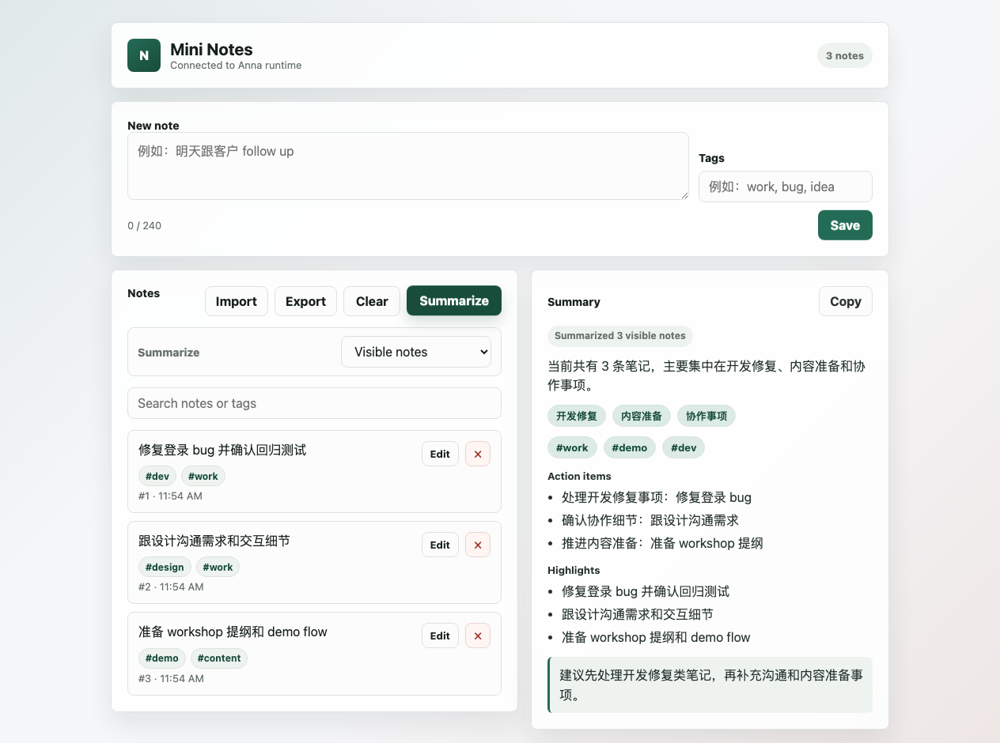

# Mini Notes Anna App

Mini Notes is a small Anna App for capturing short notes and turning them into
a structured local summary. It includes a static UI bundle, a local
Executa-style Python summarizer, and a manifest that connects the UI to the
tool through Anna's local app harness.

The app is intentionally small, but it now behaves like a practical note tool:
notes are saved in browser `localStorage`, can be edited, imported, exported,
searched, restored after accidental deletion, and summarized with structured
categories, highlights, action items, and a suggested next step.



## Features

- Add short notes up to 240 characters.
- Add lightweight comma-separated tags.
- Persist notes locally in the browser with `localStorage`.
- Edit or delete individual notes.
- Clear all notes when starting over.
- Undo the latest delete, clear, or import operation.
- Search across note content and tags.
- Choose whether Summarize uses visible search results or all notes.
- Import compatible Markdown exports back into the app.
- Export the current note view as Markdown.
- Copy the latest structured summary to the clipboard.
- Summarize notes through Anna's `tools.invoke` host API.
- Return structured summary data from the local Python Executa:
  - `summary`
  - `categories`
  - `tags`
  - `highlights`
  - `action_items`
  - `suggested_next_step`
- Run without an external LLM, external API, database, or cloud service.

## Project structure

```text
miniapp/
├── app.json
├── manifest.json
├── package.json
├── bundle/
│   ├── index.html
│   ├── style.css
│   ├── app.js
│   └── icon.svg
├── executas/
│   └── mini-notes/
│       ├── mini_notes_plugin.py
│       ├── pyproject.toml
│       └── README.md
├── fixtures/
│   └── happy-path.jsonl
├── scripts/
│   ├── anna-app-with-uv-path.mjs
│   ├── anna-bridge-windows.py
│   └── run-python-test.mjs
└── tests/
    └── test_tool_contract.py
```

## How it works

`bundle/` contains the user interface. The browser keeps notes in local state
and mirrors them into `localStorage`, so refreshing the app does not lose the
current note list. Each note can also carry up to six tags. The search box
filters the visible notes by content or tag. Export uses the current visible
note set. Summarize can use either the current visible set or all notes,
depending on the selected scope.

When the user clicks Summarize, `bundle/app.js` calls Anna's host API:

```js
anna.tools.invoke({
  tool_id: "tool-test-mini-notes-12345678",
  method: "summarize",
  args: { notes }
});
```

`manifest.json` declares the required `tools.invoke` permission and allow-lists
the required Executa ID. This means the UI can call the Mini Notes summarizer,
not arbitrary local tools.

`executas/mini-notes/mini_notes_plugin.py` implements a line-delimited JSON-RPC
2.0 tool over stdin/stdout. Anna calls `describe` to inspect the tool, then
calls `invoke` with `tool="summarize"` and the current notes. The Python tool
uses keyword rules to produce a deterministic local summary.

The local harness is the development version of the Anna runtime. It opens the
UI, reads the manifest, starts the local Executa, and connects
`anna.tools.invoke` to the Python process.

## Install dependencies

Install Node dependencies for the Anna CLI:

```bash
npm install
```

The local harness also needs `uvx`. If `anna-app doctor` reports that `uv` is
missing, install it once:

```bash
brew install uv
```

or:

```bash
python3 -m pip install --user uv
```

The Mini Notes tool itself uses only the Python standard library. Python 3.9+
is enough.

## Run locally

From the repository root:

```bash
npm run doctor
npm run check
npm run dev
```

`npm run dev` prints a local dashboard URL, usually:

```text
http://localhost:5180/
```

Open that URL, add a few notes, click Summarize, and confirm the dashboard log
shows a `tools.invoke` call.

## Import/export format

Export creates a Markdown file with this shape:

```md
# Mini Notes Export

Exported: 2026-05-15, 10:00:00 AM

## Notes

### Note 1

修复登录 bug

Tags: #dev #work
```

Import reads the same `### Note ...` blocks and optional `Tags:` lines. Imported
notes are appended to the current list and can be undone immediately.

## Test

Run all checks:

```bash
npm run check
```

This runs:

- `anna-app validate --strict`
- the Python tool contract tests
- fixture verification for `fixtures/happy-path.jsonl`

Run the browser UI tests:

```bash
npm run test:ui
```

The UI tests use Playwright with a mocked `AnnaAppRuntime`. They cover adding
tagged notes, search, Visible/All summary scope, copy, localStorage persistence,
delete undo, Markdown import, and Markdown export.

If this is the first time running Playwright on a machine, install the browser
once:

```bash
npx playwright install chromium
```

Update the README screenshot after UI changes:

```bash
npm run screenshot
```

The screenshot script seeds a mocked Anna runtime and writes
`assets/screenshot-1.png`.

Run only the tool tests:

```bash
npm test
```

`scripts/run-python-test.mjs` chooses a compatible Python executable across
macOS, Linux, and Windows.

## Manual JSON-RPC checks

Describe:

```bash
echo '{"jsonrpc":"2.0","id":1,"method":"describe"}' | python3 executas/mini-notes/mini_notes_plugin.py
```

Invoke:

```bash
echo '{"jsonrpc":"2.0","id":2,"method":"invoke","params":{"tool":"summarize","arguments":{"notes":[{"order":1,"content":"修复登录 bug","tags":["dev"]},{"order":2,"content":"跟设计沟通需求","tags":["work","design"]},{"order":3,"content":"准备 workshop 提纲","tags":["work"]}]}}}' | python3 executas/mini-notes/mini_notes_plugin.py
```

Expected result shape:

```json
{
  "success": true,
  "data": {
    "summary": "当前共有 3 条笔记，主要集中在开发修复、内容准备和协作事项。",
    "count": 3,
    "categories": ["开发修复", "内容准备", "协作事项"],
    "tags": ["dev", "work", "design"],
    "highlights": ["修复登录 bug", "跟设计沟通需求", "准备 workshop 提纲"],
    "action_items": [
      "处理开发修复事项：修复登录 bug",
      "确认协作细节：跟设计沟通需求",
      "推进内容准备：准备 workshop 提纲"
    ],
    "suggested_next_step": "建议先处理开发修复类笔记，再补充沟通和内容准备事项。",
    "orders": [1, 2, 3]
  }
}
```

On Windows PowerShell, set UTF-8 output before sending Chinese text:

```powershell
$OutputEncoding = [System.Text.Encoding]::UTF8
[Console]::OutputEncoding = [System.Text.Encoding]::UTF8
```

## Notes on IDs

This project uses the development ID `tool-test-mini-notes-12345678` in four
places:

- `manifest.json` required executas
- `manifest.json` UI host API allow-list
- `bundle/app.js` `TOOL_ID`
- `executas/mini-notes/mini_notes_plugin.py` `TOOL_ID`

For a real Anna platform submission, mint a tool ID in Anna and replace all four
occurrences with the minted value.

## Privacy

Notes are stored in browser `localStorage` for this app's local origin. The app
does not use a database, cloud deployment, external account, external LLM, or
third-party API.

## Future improvements

- Add richer Markdown import for arbitrary note files.
- Add pinned notes and sort options.
- Add a small UI test for edit/cancel flows.
- Add optional Anna storage API support when available.
- Replace the development tool ID with a minted Anna platform tool ID.
